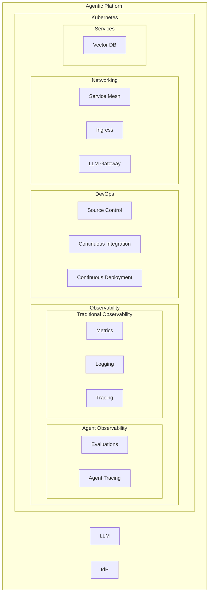
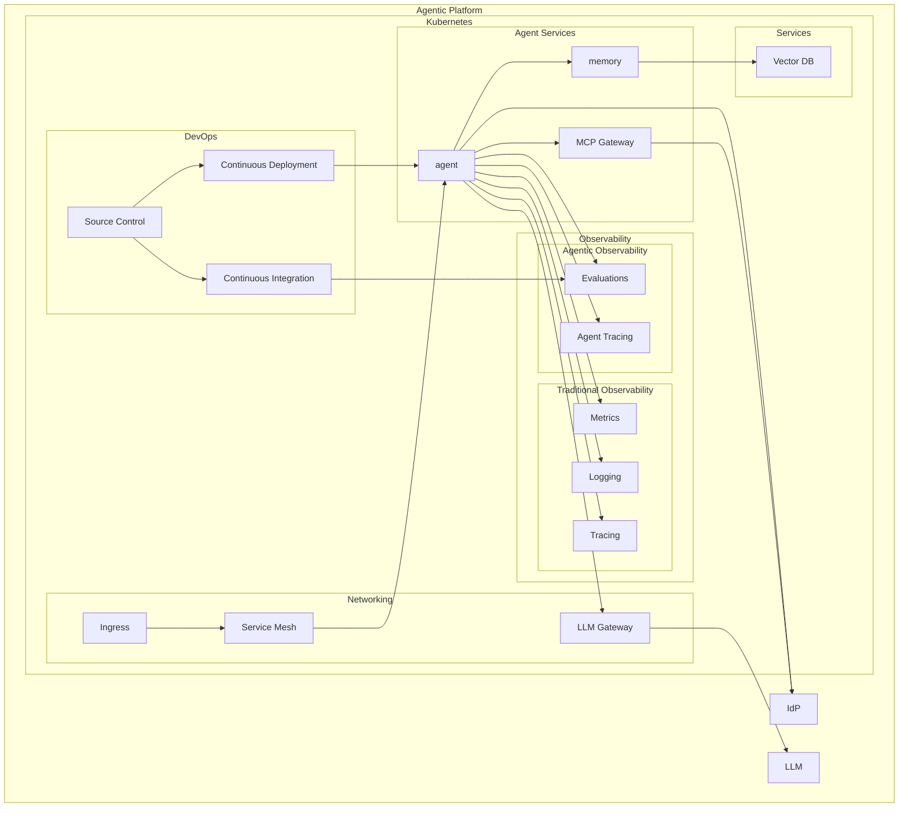

# Reference Architecture for Agentic Platforms

We propose a reference architecture for components needed to create a secure, scalable, and reliable system for running
agentic AI in production environments. This architecture collects the necessary components and articulates why each
component is required. It does not specify the implementation of the component, but rather outlines its purpose, leaving
the implementation detail up to the user. Others may take this architecture and create an opinionated reference
implementation out of it.

## Assumptions

We make a few assumptions and leave the implementation details out. While these assumptions form the basis of the
architecture, this architecture can be adapted to work around the assumptions. Additionally, the architecture aims to
self-host as many components as possible. We exclude two primary components from self-hosting: Identity Provider and
LLM. While it is possible to self-host either, we believe most would choose to use an external IdP for security and/or
organizational reasons (already using an IdP elsewhere) and the LLM Gateway would allow the choice of using an internal
LLM or one provided by an outside provider.

### Containers

This architecture assumes that the agents will ultimately run as containerized services. This architecture does not
assume the runtime of the containers (CRI), the makeup of the container layers, nor how the container lifetime is
manager; however, we do assume that code is being containerized and those containers are being orchestrated

### Kubernetes

As the architecture assumes containerization of code, the lifecycle of the containers need to be orchestrated.
Kubernetes is assumed to be the orchestration environment. While there are other orchestration environments, we
recognize that Kubernetes is an industry standard and much of the industry tooling is built around it.

## Architecture

## Cluster Basic

This section highlights the core cluster components needed to run an Agentic Platform

### Kubernetes

The orchestration layer serves as the core of the agentic platform. Beyond basic container orchestration, it provides
essential control plane components including the API server for resource management, scheduler for pod placement, and
controller manager for maintaining state. The platform leverages Kubernetes' capabilities for resource quotas, network
policies, and RBAC to ensure secure and efficient operation of AI workloads.

### Autoscaling

Autoscaling dynamically adjusts resources based on metrics like GPU utilization, request queues, or custom metrics from
agent activity, ensuring cost-efficiency while maintaining performance SLAs.

#### Node Autoscaling

Node autoscaling manages the dynamic provisioning and deprovisioning of cluster nodes in response to workload demands.
It facilitates cost optimization strategies while ensuring sufficient capacity is always available for Agentic
operations. The system includes drain and maintenance procedures to ensure zero-downtime operations during scaling
events.

#### Pod Autoscaling

Pod autoscaling handles the scaling of individual AI services through horizontal (HPA) and vertical (VPA)
scaling mechanisms. It operates based on custom metrics such as LLM queue length and resource utilization patterns. The
system maintains buffer capacity to handle sudden spikes in demand while optimizing resource usage during normal
operations.

## Networking

### Service Mesh

The service mesh layer enables service-to-service communication capabilities for agentic systems. It implements mutual
TLS for secure communication, load balancing for resource utilization, and circuit breaker patterns to prevent failures.
The mesh enables monitoring of inter-service communication and service discovery mechanisms for dynamic AI environments.

### Traffic Shaping

Traffic shaping capabilities ensure fair and efficient use of AI resources across the platform. It implements request
rate limiting, QoS policies, and tenant isolation to prevent resource monopolization. The system supports traffic
splitting for A/B testing of AI models and agent behaviors, enabling rollouts of new capabilities.

### Ingress

The ingress controller serves as the entry point for external traffic to the agentic platform. It handles SSL/TLS
termination, routing based on paths and headers, and supports load balancing across services. The ingress integrates
with authentication systems to ensure secure access to AI services.

### LLM Gateway

Manages all interactions with large language models. It facilitates routing between different models and
providers, caching strategies to reduce costs, and maintains detailed usage metrics. The gateway includes prompt
validation and response filtering capabilities, along with token usage tracking, guardrails, and cost allocation
mechanisms.

## DevOps

### Source Control

Source control serves as the single source of truth for all AI system components, including prompt engineering,
infrastructure definitions, and configuration management. It maintains version history and audit trails for all changes
to the system, enabling compliance tracking and rollback capabilities. It implements branch protection rules and
code review processes, ensuring that changes to critical AI systems undergo proper review.

### Continuous Integration (CI)

The CI pipeline automates the testing and validation of AI system components. It includes automated testing of agent
behaviors, security scanning for potential vulnerabilities, and dependency management for AI libraries. The system
implements quality gates, ensuring that changes meet performance and safety criteria before deployment.

### Continuous Deployment (CD)

CD processes automate safe deployment through GitOps workflows. It implements deployment strategies including canary
releases and blue-green deployments. The system includes automated rollback capabilities triggered by performance
metrics, ensuring system stability during updates.

## Observability

### Traditional Observability

Captures metrics (latency, throughput, resource usage), logs (application and system logs), and distributed traces.
Provides operational visibility into the infrastructure and service health of the platform.

#### Metrics

The metrics system collects and analyzes both system-level and AI-specific performance indicators. It tracks resource
utilization, request latencies, and error rates, while also monitoring metrics such as inference times and
model performance. The system implements SLI/SLO tracking, enabling proactive management of service quality.

#### Logs

The logging system facilitates structured logging for infrastructure components, traditional applications, and agentic
applications. It captures both system events and AI decision-making processes, enabling detailed analysis of agent
behaviors. The system includes retention policies and search capabilities, making it possible to audit AI
actions and troubleshoot complex behavioral patterns.

#### Traces

Distributed tracing enables end-to-end visibility into AI operations across the platform. It tracks request flows
through various components, enabling performance optimization and bottleneck identification. The system implements
context propagation, making it possible to understand agent interactions and decision chains.

### Agentic Observability

Specialized monitoring for metrics including prompt/response quality, hallucination detection, task completion rates,
and agent behavior patterns. Includes evaluation frameworks for measuring agent performance against benchmarks and
detecting drift or degradation in AI capabilities.

#### Evaluations

The evaluation framework continuously assesses AI agent performance against established benchmarks. It tracks quality
metrics, accuracy measurements, and behavioral patterns. The system includes regression testing capabilities to detect
changes in agent behavior over time.

#### Tracing

Agent tracing empowers detailed visibility into AI decision-making processes. It tracks decision paths, action
sequences, and context utilization patterns, enabling analysis of agent behaviors. The system maintains logs of
inter-agent communications and task completion flows, enabling debugging and optimizing agent interactions.

#### Testing Dataset

Testing datasets provide ground truth inputs and outputs to enable offline, use case based evaluations of agents.
Combining testing datasets with evaluation metrics enables quantitative understanding of agent performance and decision
based rollouts of new agent versions.

#### Prompt Management

Prompt management provides version control and template management for AI system prompts. It tracks prompt performance
metrics and usage analytics, enabling optimization of prompt engineering efforts. The system supports cost tracking
and optimization strategies for prompt usage.

## Services

### Vector Database

The vector database serves as a persistence layer for AI operations, storing and managing high-dimensional
embeddings for semantic search and retrieval operations. The system includes backup and restore capabilities,
along with optimization features designed for large-scale embedding operations and real-time retrieval requirements. The
vector database is used as a persistent backing layer for agent memory.

## Agentic Services

### Agent Code

The agent code component encapsulates the core logic and behaviors of AI agents within the system. It implements state
management mechanisms to maintain agent context across interactions and includes error handling.

### Large Language Model (LLM)

LLMs enable agents to understand natural language and reason and plan. They connect to knowledge bases to aid in
providing contextual grounding for answering questions and planning as well as aid in identifying correct tool usage for
a task.
### Model Context Protocol (MCP) Gateway

The MCP gateway is a centralized gateway for MCP servers. It enables access controls for authenticating and authorizing
agents' use of MCP servers. It provides a central location to discover MCP servers, identify the right tool,
and allow dynamic discovery of capabilities without needing to code them into the agent.

## Security

### Identity Provider (IdP)

The Identity Provider implements authentication and authorization services. It manages secure access to resources
through token management and SSO capabilities. The system maintains audit logs of all access attempts and implements
compliance reporting. Security policies are enforced across all AI components, ensuring that access to sensitive AI
capabilities is controlled and monitored.

## Interaction

## Other Components

We recognize that in a full Agentic ecosystem, other components will be integrated with which agents will interact.
Fully capturing all of these components and elaborating them is out of scope for the current version of this proposal;
however, we will make a best-effort attempt to list out some areas which may need to be further explored.

### Data Lineage

Data lineage is a core component of data access governance. Knowing who accessed what data and when is important. It is
assumed that production systems providing data access already have data lineage as a component of their infrastructure.  
